# Private Deployment Dify with Knowledge Base on TiDB Cloud Serverless
## Overview
Dify is an open-source large language model (LLM) application development platform, designed to help developers, enterprises, and even non-technical personnel quickly build, deploy, and manage AI-based applications. It supports RAG (Retrieval-Augmented Generation) to enhance the accuracy of responses by combining external knowledge bases. In PingCAP's official blog, there was previously an article on [Dify.AI x TiDB](https://www.pingcap.com/blog/dify-tidb-build-scalable-ai-agent-with-knowledge-base/) that introduced how to deploy Dify locally with TiDB Serverless to build Dify's knowledge base. This article is slightly different, as it will introduce how to configure a knowledge base that supports vector + **FTS (Full-Text Search)** based on the Qdrant protocol.

## Prerequisites
_The recommended environment by Dify._

**Hardware Environment:**
- CPU >= 2 Core
- GPU Memory/RAM ≥ 16 GiB (Recommended)

**Software Environment:**
- [Docker](https://www.docker.com/)
- Docker Compose
- [Dify Community Edition](https://github.com/langgenius/dify)

TiDB Vector Search (beta) provides an advanced search solution for performing semantic similarity searches on various data types, including documents, images, audio, and video. This feature allows developers to easily build AI applications using familiar MySQL skills. TiDB Cloud Serverless also provides a compatibility layer for most of the commonly used functions of Qdrant, facilitating users to quickly validate and migrate applications built on Qdrant.

## TiDB preparation work
[TiDB Vector Search (beta)](https://docs.pingcap.com/tidbcloud/vector-search-overview/) provides an advanced search solution for performing semantic similarity searches on various data types, including documents, images, audio, and video. This feature allows developers to easily build AI applications using familiar MySQL skills. [TiDB Cloud Serverless](https://docs.pingcap.com/tidbcloud/select-cluster-tier/#tidb-cloud-serverless) also provides a compatibility layer for most of the commonly used functions of Qdrant, facilitating users to quickly validate and migrate applications built on Qdrant.

### Create a TiDB Cloud Serverless Cluster
1. Login into [TiDB Cloud](https://tidbcloud.com/) console
2. Go to the `Cluster` page and click [Create Cluster](https://tidbcloud.com/console/clusters/create-cluster).
    - Select the `Serverless` Tier.
    - Choose the `us-east-1` Region (currently, the Qdrant compatibility layer is only available in the `us-east-1` region).
    - Select the `Free Cluster` Plan (both `Free` and `Scalable` plans offer the same functionality, choose as needed).
3. Click the `Create` button and wait for the cluster to be created.

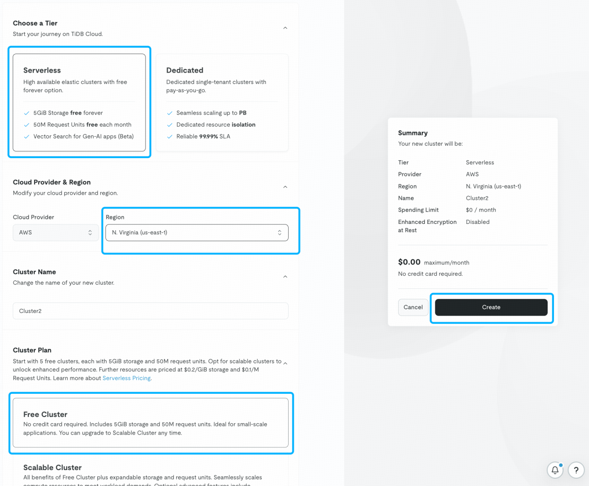

### Obtain Cluster Information
After the cluster is created, go to the details page of the newly created cluster.
1. Click the `Connect` button in the upper right corner.
2. In the pop-up page, click the `Generate Password` button.
3. Save the corresponding `USERNAME` and `PASSWORD`.

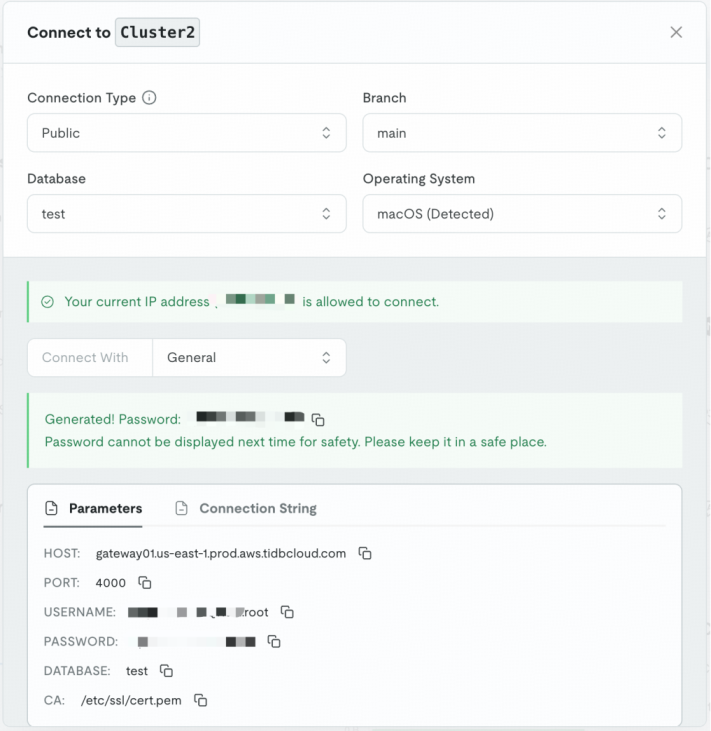

The way to access Qdrant compatibility layer is slightly different from that of TiDB Cloud Serverless itself. In addition to saving the USERNAME and PASSWORD, you need to saving this Qdrant access point:
- **qdrant-gateway01.us-east-1.prod.aws.tidbcloud.com**

## Deploy Dify Using Docker Compose
Visit the Dify GitHub project page and run the following commands to finish the code repository pull and installation process.

```bash
git clone https://github.com/langgenius/dify.git
cd dify/docker
cp .env.example .env
vi .env
```

Change `VECTOR_STORE` to `qdrant`.

```bash
# Using TiDB Cloud Serverless by Qdrant compatibility layer
VECTOR_STORE=qdrant

# The Qdrant endpoint URL. Only available when VECTOR_STORE is `qdrant`.
QDRANT_URL=qdrant-gateway01.us-east-1.prod.aws.tidbcloud.com
# The USERNAME and PASSWORD in TiDB Serverless are mapped to the QDRANT_API_KEY in the format of USERNAME:PASSWORD
QDRANT_API_KEY={USERNAME}:{PASSWORD}
QDRANT_CLIENT_TIMEOUT=20
QDRANT_GRPC_ENABLED=false
QDRANT_GRPC_PORT=443
```

For the season Dify defaults to using VECTOR_STORE as weaviate and starts a local weaviate container in the docker-compose, you can skip this container. _Alternatively, you can do nothing and run a redundant weaviate container._

```bash
vi docker-compse.yaml # 注释掉 weaviate: 及相关的配置

docker compose up -d
```

After the command runs successfully, you should see the status and port mappings of all containers.

- The default port used is 80. Access the login address at [http://localhost/install](http://localhost/install).
- Setup the administrator username and password to enter the system.

For the most infomation, refer to the [Docker Compose deployment](https://docs.dify.ai/zh-hans/getting-started/install-self-hosted/docker-compose) or the [source code deployment](https://docs.dify.ai/getting-started/install-self-hosted/local-source-code) methods.

## Configure and Use Dify
Unlike other common AI agents, Dify supports multi-model + knowledge base workflow orchestration design. After Dify is installed, you need to prepare the models and knowledge bases first.

### Install Models
Go to **Profile → Settings → Model Providers** in the Dify platform., select a model provider, click on the `Install` button for the corresponding model, and set the model's `API-KEY`.

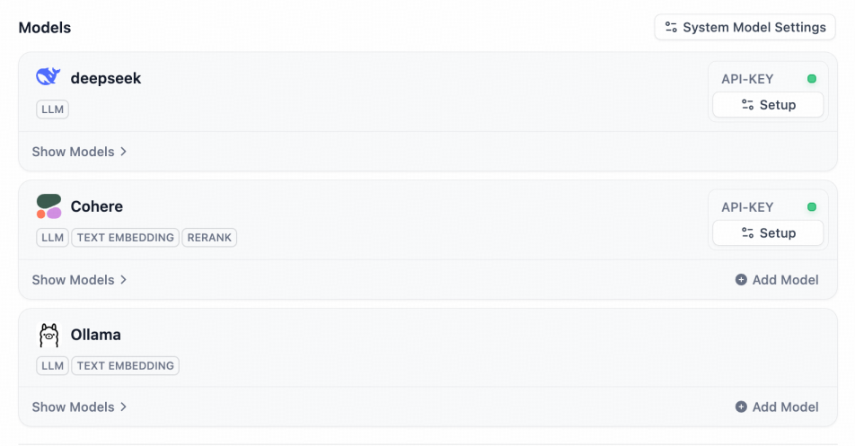

_If you are not sure which model to choose, it is recommended to install the **Cohere** model, which includes all the basic functions needed by Dify in this tutorial. Dify also provides a pure local [Ollama + Deepseek + Dify](https://github.com/langgenius/dify-docs/blob/main/zh_CN/learn-more/use-cases/private-ai-ollama-deepseek-dify.md) deployment solution._

### Prepare a Knowledge Base Based on TiDB Cloud Serverless
We have already configured the Qdrant endpoint for TiDB Serverless. Here, we can directly use Dify's "Create Knowledge Base" module.

1. Click `Knowledge` in top menu.
2. Click the `Create Knowledge` button.
3. Upload files and proceed to the next step.
4. Set the indexing parameters:
   - You can choose the default parameters in the General section.
   - Select **High Quality** for indexing method.
   - Choose **Hybrid Search** for retrieval settings.

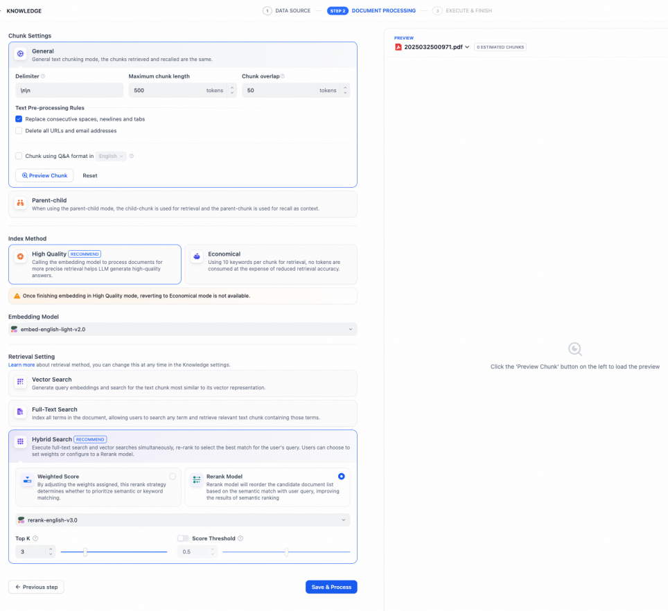

Indexing parameter explanation:
- **Vector Search**: Pure vector recall strategy.
- **Full-Text Search**: Full-text search based on inverted index.
- **Hybrid Search**: Dual recall using vector + inverted index, followed by ranking using a Rerank model.

_Note: If you are using a free trial model API-KEY, you may encounter `call limitations`. When building the knowledge base, try using small documents. If the issue persists, consider deploying a local large model by [ollama](https://ollama.com/)._

**The completed knowledge base will look like this:**

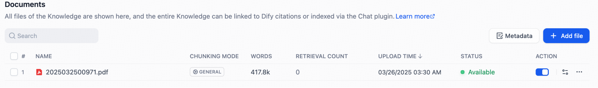

### Create an AI Chatflow
Dify supports various complex workflows. Here, we will only introduce a simple chatflow process.

1. Click on the `Create from Blank` on the left side of the Dify platform homepage, select the `Chatflow` application and name it.
2. Right-click and click `Add Block`, then select `Knowledge Retrieval`.

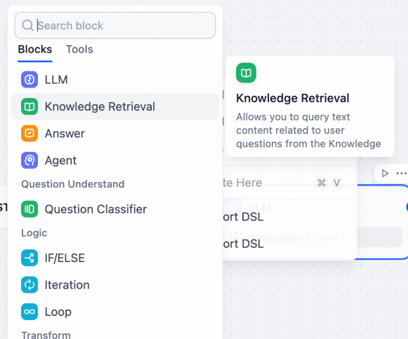

3. Link all nodes

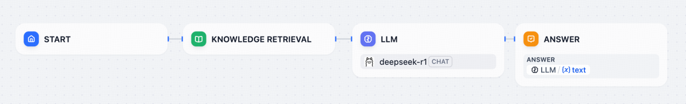

4. Select the `Knowledge Retrieval` node
- Click the `+` button to add a `Knowledge Base`.

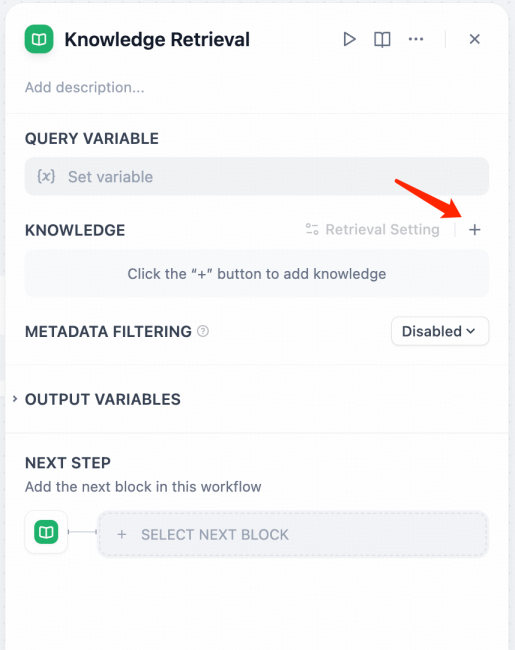

- Set the `Query Variable` to `{{#sys.query#}}`.

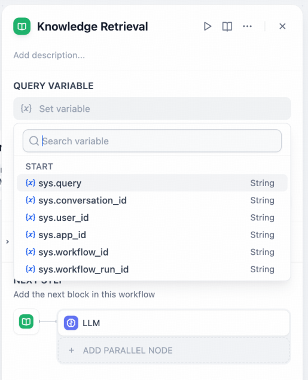

- Click on `Retrieval Setting` to configure the model parameters.

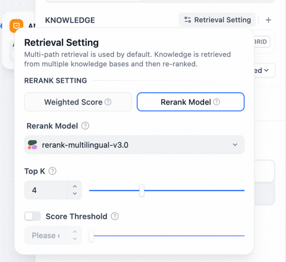

5. Select the `LLM` node:
- Choose the model.
- Set the `Context` to `Knowledge Retrieval - result`.
- Add a system prompt `SYSTEM`, `{{#sys.query#}}` + `Context`.

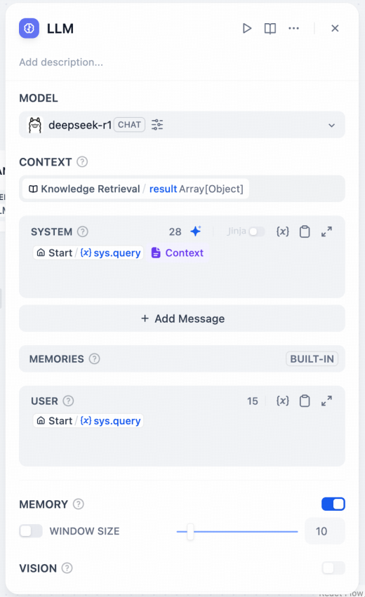

6. Click `Publish`

_During debugging, you can use the "Preview" function for testing._

## Try Out the Newly Created AI Chatflow
Click on the "Explore" menu at the top and select the chatflow you just created to start using it.

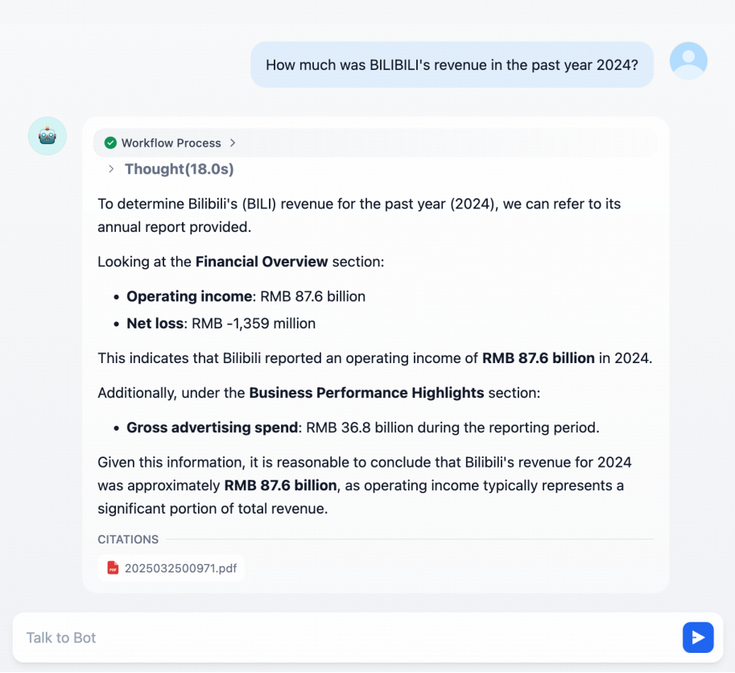

## Why Choose TiDB Cloud Serverless
TiDB Cloud Serverless is suitable for teams that require **low cost, high elasticity, and zero maintenance**, especially for scenarios such as **Web3, AI, SaaS, and data analytics**. Its core advantages lie in **fully managed services, pay-as-you-go pricing, HTAP capabilities, and AI integration**, helping users quickly build and scale applications.

1. **Fully Managed & Zero Maintenance**
   - TiDB Cloud Serverless provides a fully managed database-as-a-service (DBaaS). Users do not need to manually configure clusters, maintain high availability, or handle backup and recovery tasks, significantly reducing maintenance burdens.
   - It automatically performs routine management tasks such as upgrades and scaling, allowing teams to focus on business development rather than infrastructure maintenance.

2. **Elastic Scaling & Pay-As-You-Go**
   - Automatically scales up or down based on business load. It expands resources during peak times and scales down to zero when idle, avoiding resource waste.
   - It adopts a "Pay as You Go" pricing model, charging only for the actual resources used. Compared to traditional cloud databases, it can reduce costs by 50%-80%.

3. **High-Performance HTAP (Hybrid Transactional and Analytical Processing)**
   - A single database supports both OLTP (Online Transaction Processing) and OLAP (Online Analytical Processing), eliminating the need for additional data warehouses and enabling real-time data analysis.
   - It includes the TiFlash columnar storage engine, which optimizes the performance of analytical queries.

4. **AI-Enhanced & Vector Search Integration**
   - It includes built-in vector search capabilities, supporting the storage and retrieval of unstructured data (such as text embeddings), simplifying the development of AI applications without the need for additional vector databases.
   - It provides AI tools like Chat2Query, which support natural language generation of SQL, improving development efficiency.

5. **MySQL Compatibility & Seamless Ecosystem Integration**
   - Fully compatible with the MySQL protocol, allowing existing applications to migrate seamlessly and supporting mainstream ORMs, BI tools, and development frameworks.
   - It offers TiDB Cloud APIs and Terraform support for easy automation of operations.

6. **Enterprise-Level Security and Compliance**
   - Certified by SOC 2 Type II, GDPR, HIPAA, etc., with TLS encryption, RBAC (Role-Based Access Control), and multi-factor authentication (MFA) enabled by default.
   - It performs daily automatic backups and supports point-in-time recovery (PITR) to ensure data security.

## Why Choose Dify

Dify is suitable for developers, enterprises, and AI enthusiasts, especially for teams that need to **rapidly build, flexibly scale, and continuously optimize AI applications**. Its core advantages lie in **usability, support for multiple models, end-to-end LLMOps, and powerful automation capabilities**, helping users efficiently achieve AI-driven business innovation.

1. **Simplified AI Application Development, Lowering Technical Barriers**
   - Dify provides a visual orchestration tool that supports drag-and-drop construction of complex AI workflows, eliminating the need for in-depth code writing. This allows non-professional developers to quickly create AI applications.
   - It includes a Prompt IDE that helps developers optimize prompts to improve model output quality and supports multi-model comparison testing.

2. **Support for Multiple Large Language Models (LLMs), Flexible Adaptation to Needs**
   - Compatible with mainstream LLMs such as GPT, Mistral, and Llama3, and supports self-hosted or third-party inference services, offering highly flexible model selection.
   - It can be integrated with existing AI application ecosystems through NewAPI, which is compatible with the OpenAI API standard.

3. **End-to-End LLMOps Support, Optimizing the Entire AI Application Lifecycle**
   - Covers the entire process of data preparation, model training, deployment, monitoring, and optimization, providing a continuous improvement mechanism to ensure efficient operation of AI applications.
   - It supports RAG (Retrieval-Augmented Generation), which can directly process documents such as PDFs and PPTs, simplifying the construction of knowledge bases.