# 私有化部署 Dify + TiDB Cloud Serverless
## 概述
Dify 是一个开源的大语言模型（LLM）应用开发平台，旨在帮助开发者、企业甚至非技术人员快速构建、部署和管理基于 AI 的应用。支持 RAG 结合外部知识库提升回答准确性。在 Pingcap 官方 blog 中，之前 [Dify.AI x TiDB](https://www.pingcap.com/blog/dify-tidb-build-scalable-ai-agent-with-knowledge-base/) 的这篇文章中有介绍如何在本地部署 Dify + TiDB Serverless 构建 Dify 的知识库。本篇稍有不同，将介绍如何配置基于 Qdrant 协议，同时支持 vector + **FTS(Fulltext search)** 的知识库构建。

## 前置准备
_Dify 官方的推荐环境。_

**硬件环境：**
- CPU >= 2 Core
- 显存/RAM ≥ 16 GiB（推荐）

**软件环境：**
- [Docker](https://www.docker.com/)
- Docker Compose
- [Dify 社区版](https://github.com/langgenius/dify)

## TiDB 准备工作
[TiDB Vector Search (beta)](https://docs.pingcap.com/tidbcloud/vector-search-overview/) 提供了一种高级搜索解决方案，用于对各种数据类型（包括文档、图像、音频和视频）执行语义相似性搜索。此功能使开发人员能够使用熟悉的 MySQL 技能轻松构建 AI 应用程序。[TiDB Cloud Serverless](https://docs.pingcap.com/tidbcloud/select-cluster-tier/#tidb-cloud-serverless) 同时还提供了 Qdrant 大部分常用功能的兼容层，方便用户快速验证和迁移基于 Qdrant 构建的应用。

### 创建 TiDB Cloud Serverless 集群
1. 登录 [TiDB Cloud](https://tidbcloud.com/) 控制台
2. 进入 Cluster 页面，点击 [Create Cluster](https://tidbcloud.com/console/clusters/create-cluster)
    - 选择 "Serverless" 类型 Tier
    - 选择 "us-east-1" Region (目前 qdrant 兼容层只提供 "us-east-1" 区域的实例)
    - 选择 "Free Cluster" Plan (Free 和 Scalable 两种 Plan 提供相同的功能，可按需选择)
3. 点击 "Create" 按钮，等待 Cluster 创建完成

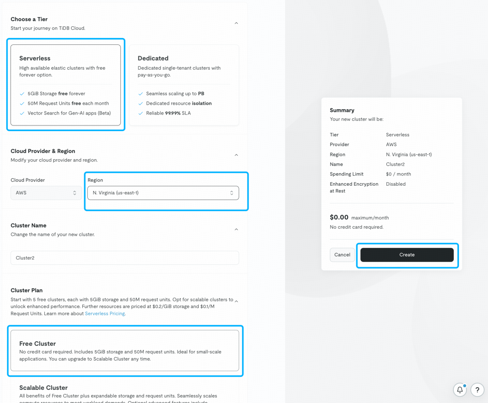

### 获取 Cluster 信息
Cluster 创建完成后，进入刚刚创建完成的 Cluster 详情页。
1. 点击右上角 "Connect" 按钮
2. 在弹出的页面中点击 "Generate Password" 按钮
3. 保存对应的 USERNAME 和 PASSWORD

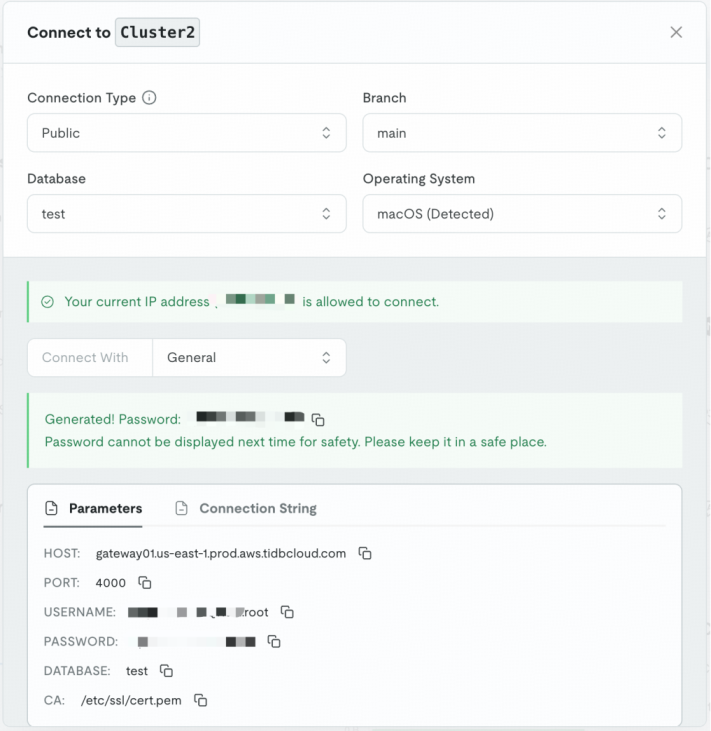

Qdrant 兼容层的接入方式和 TiDB Cloud Serverless 本身的接入方式有一些差别，除了需要记住 USERNAME 和 PASSWORD 之外，这里需要记住 qdrant 接入点。
- qdrant-gateway01.us-east-1.prod.aws.tidbcloud.com

## 部署 Dify
访问 Dify GitHub 项目地址，运行以下命令完成拉取代码仓库和安装流程。

```bash
git clone https://github.com/langgenius/dify.git
cd dify/docker
cp .env.example .env
vi .env
```

修改 VECTOR_STORE 为 qdrant。

```bash
# 请注意，由于 serverless 提供了 qdrant 的兼容层，这里直接配置成 "qdrant" 即可
VECTOR_STORE=qdrant

# The Qdrant endpoint URL. Only available when VECTOR_STORE is `qdrant`.
QDRANT_URL=qdrant-gateway01.us-east-1.prod.aws.tidbcloud.com
# TiDB Serverless 中的 USERNAME 和 PASSWORD 映射成 QDRANT_API_KEY 的格式为 USERNAME:PASSWORD
QDRANT_API_KEY={USERNAME}:{PASSWORD}
QDRANT_CLIENT_TIMEOUT=20
QDRANT_GRPC_ENABLED=false
QDRANT_GRPC_PORT=443
```

由于 Dify 默认使用的 VECTOR_STORE 是 weaviate, 并且在 docker compose 中启动了一个本地 weaviate 容器，这里可以省去该容器。_这里也可以什么也不做，冗余的运行一个 weaviate 容器。_

```bash
vi docker-compse.yaml # 注释掉 weaviate: 及相关的配置

docker compose up -d
```

等待命令运行成功后，你应该会看到所有容器的状态和端口映射。
- 默认使用的 80 端口，访问登录地址 [http://localhost/install](http://localhost/install)
- 设置管理员用户名和密码，进入系统

详细说明可以参考 [Docker Compose 部署](https://docs.dify.ai/zh-hans/getting-started/install-self-hosted/docker-compose)，也可以参考 [源码部署](https://docs.dify.ai/getting-started/install-self-hosted/local-source-code) 方式。

## 配置使用 Dify

和其它常见 ai agent 不同，Dify 支持多模型 + 知识库工作流编排设计。Dify 安装完毕后，需要先准备模型和知识库。

### 安装模型

点击 Dify 平台右上角**头像 → 设置 → 模型供应商**，选择模型供应商，轻点对应模型的"安装"，并且设置相关模型的 API-KEY。

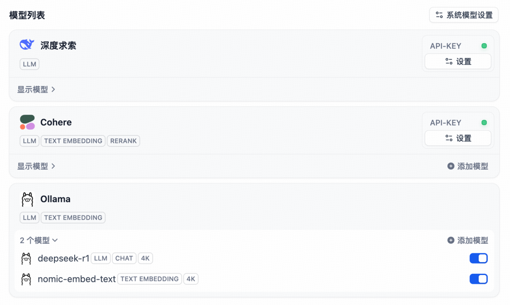

_如果你不是很了解该如何选择模型，推荐安装 **Cohere** 一个模型即可，该模型包含了 Dify 在此教程中所需的所有基本功能。Dify 官方也提供了纯本地化 [Ollama + Deepseek + Dify](https://github.com/langgenius/dify-docs/blob/main/zh_CN/learn-more/use-cases/private-ai-ollama-deepseek-dify.md) 部署方案。_

### 准备基于 TiDB Cloud Serverless 的知识库
以上我们已经配置好 TiDB Serverless 的 Qdrant endpoint，这里我们直接使用 Dify 的"创建知识库"功能。

1. 点击[知识库](http://localhost/datasets)菜单
2. 点击[创建知识库](http://localhost/datasets/create)按钮
3. 上传文件, 下一步
4. 设置索引参数
    - 通用里的参数可以选择默认
    - 索引方式选择：**高质量**
    - 检索设置选择：**混合检索**

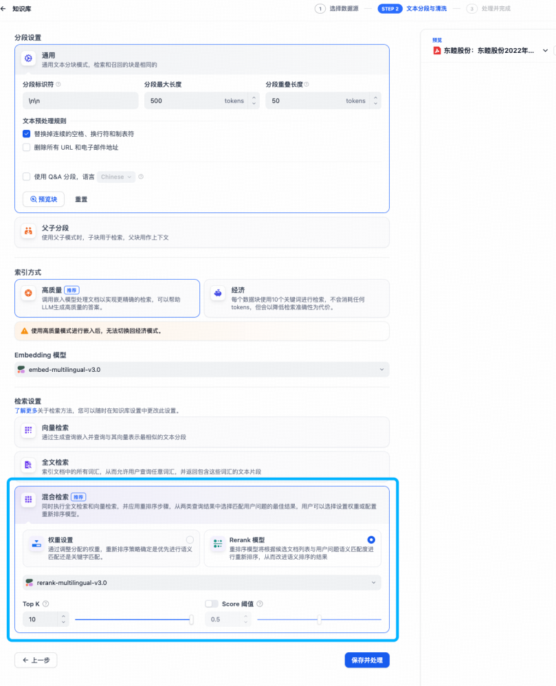

索引参数说明：
- **向量索引**：纯向量的召回策略
- **全文检索**：基于倒排索引的全文检索
- **混合索引**：基于向量+倒排索引的两路召回，并调用 Rerank 模型排序

_注意，如果你使用的是模型的免费 API-KEY，可能面临 call limited 问题，构建知识库的时候可以使用小文档试试。如果始终无法解决，可以尝试通过 [ollama](https://ollama.com/) 部署本地大模型的方案。_

**知识库完成后是这样子的。**

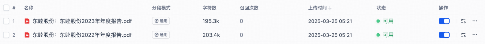

### 创建 AI Chatflow
Dify 支持各种复杂的流程，这里只介绍一个简单的 chatflow 流程。

1. 点击 Dify 平台首页左侧的"创建空白应用"，选择"Chatflow"应用并进行命名
2. 右键添加"添加节点"，选择"知识检索"

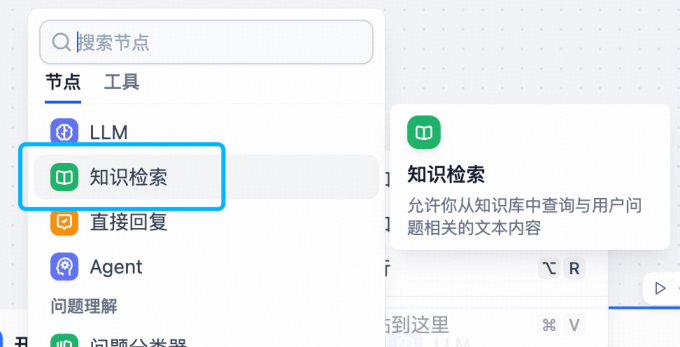

3. 点击"+"，添加"知识库"

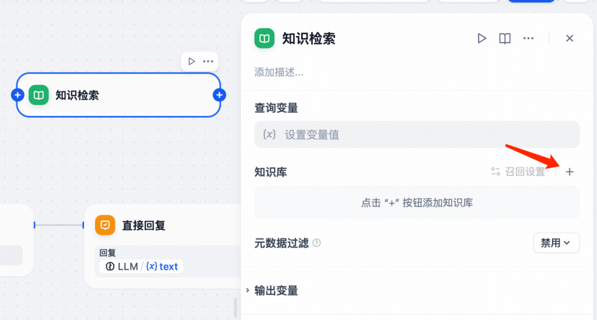

4. 设置"查询变量" `{{#sys.query#}}`

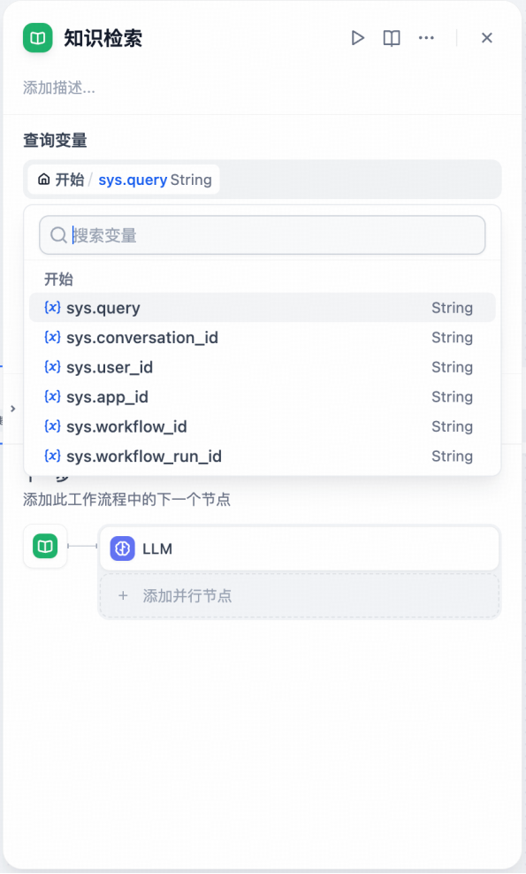

5. 点击"召回设置"，设置模型参数"模型

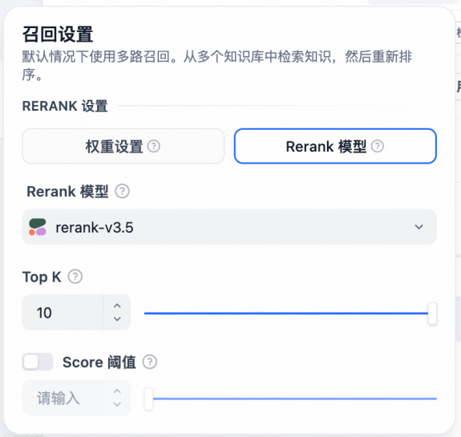

6. 选择"LLM"节点
    - 选择模型
    - 设置"上下文"为`知识检索 - result`
    - 添加系统提示词"SYSTEM"，`{{#sys.query#}}` + `上下文`

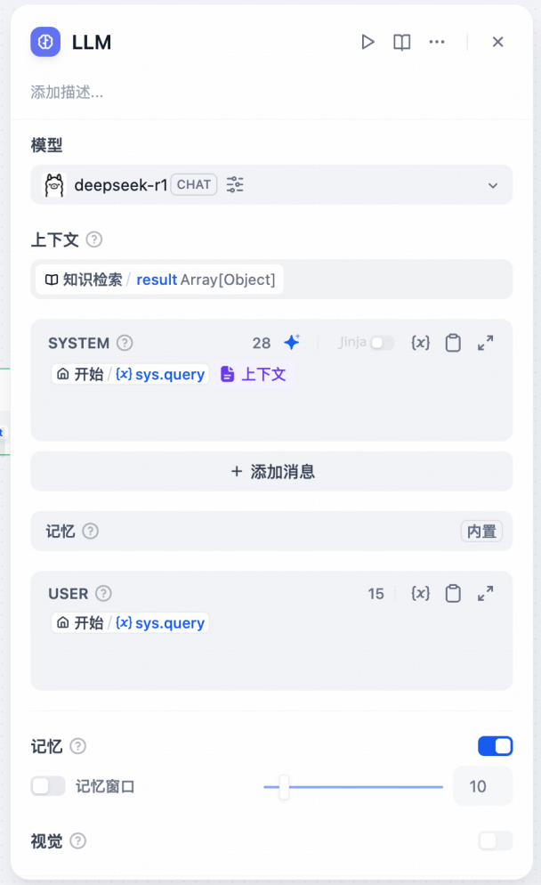

7. 链接所有节点后，发布

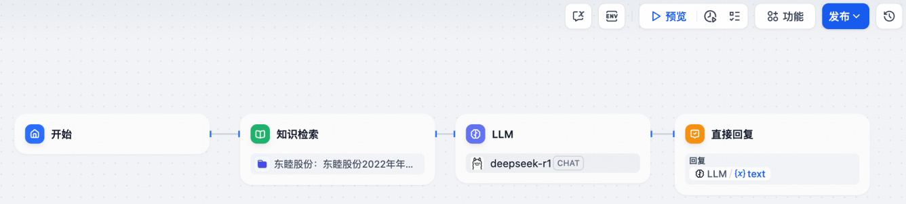

_调试过程中，可以使用"预览"进行调试。_

## 试试刚刚创建 AI Chatflow
点击顶部菜单中的"探索"，选择刚刚创建的 chatflow，就可以开始使用了。

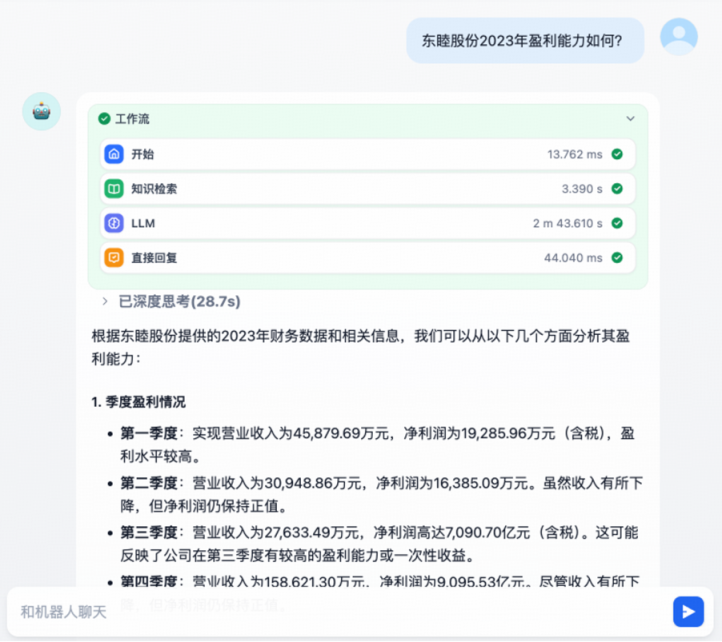

## TiDB Cloud Serverless 特点
TiDB Serverless 适合需要**低成本、高弹性、免运维**的团队，尤其适用于 **Web3、AI、SaaS 及数据分析** 等场景。其核心优势在于**自动化管理、按需计费、HTAP 能力及 AI 集成**，帮助用户快速构建和扩展应用。
1. **全托管 & 免运维**
- TiDB Serverless 提供完全托管的数据库服务（DBaaS），用户无需手动配置集群、维护高可用性或处理备份恢复等复杂任务，大幅降低运维负担。
- 自动执行日常管理任务（如升级、扩缩容），让团队专注于业务开发而非基础设施维护。
2. **弹性伸缩 & 按需付费**
- 根据业务负载自动扩缩容，高峰时扩展资源，闲置时缩减至零，避免资源浪费。
- 采用 "Pay as You Go" 计费模式，仅对实际使用的资源付费，相比传统云数据库可降低 50%-80% 成本。
3. **高性能 HTAP（混合事务与分析处理）**
- 单数据库同时支持 OLTP（在线事务处理）和 OLAP（在线分析处理），无需额外搭建数仓，实现实时数据分析。
- 内置 TiFlash 列存引擎，优化分析查询性能。
4. **AI 增强 & 向量搜索集成**
- 内置 向量搜索功能，支持存储和检索非结构化数据（如文本嵌入），简化 AI 应用开发，无需额外引入向量数据库。
- 提供 Chat2Query 等 AI 工具，支持自然语言生成 SQL，提升开发效率。
5. **MySQL 兼容 & 生态无缝集成**
- 完全兼容 MySQL 协议，现有应用可无缝迁移，支持主流 ORM、BI 工具及开发框架。
- 提供 TiDB Cloud API 和 Terraform 支持，便于自动化运维。
6. **企业级安全与合规**
- 通过 SOC 2 Type II、GDPR、HIPAA 等认证，默认启用 TLS 加密、RBAC（基于角色的访问控制）及多因素认证（MFA）。
- 每日自动备份，支持时间点恢复（PiTR），保障数据安全。

## Dify 特点
Dify 适合开发者、企业及AI爱好者，尤其适合需要**快速构建、灵活扩展、持续优化AI应用**的团队。其核心优势在于**易用性、多模型支持、全流程LLMOps及强大的自动化能力**，帮助用户高效实现AI驱动的业务创新。
1. **简化AI应用开发，降低技术门槛**
- Dify 提供 可视化编排工具，支持拖拽式构建复杂AI工作流，无需深入代码编写，让非专业开发者也能快速创建AI应用。
- 内置 Prompt IDE，帮助开发者优化提示词（Prompt），提升模型输出质量，同时支持多模型对比测试。
2. **支持多种大语言模型（LLM），灵活适配需求**
- 兼容 GPT、Mistral、Llama3 等主流LLM，并支持自托管或第三方推理服务，提供高度灵活的模型选择。
- 可通过 NewAPI 兼容 OpenAI API 标准，便于集成现有AI应用生态。
3. **端到端的LLMOps支持，优化AI应用全生命周期**
- 涵盖数据准备、模型训练、部署、监控、优化 全流程，提供持续改进机制，确保AI应用高效运行。
- 支持 RAG（检索增强生成），可直接处理PDF、PPT等文档，简化知识库构建。
